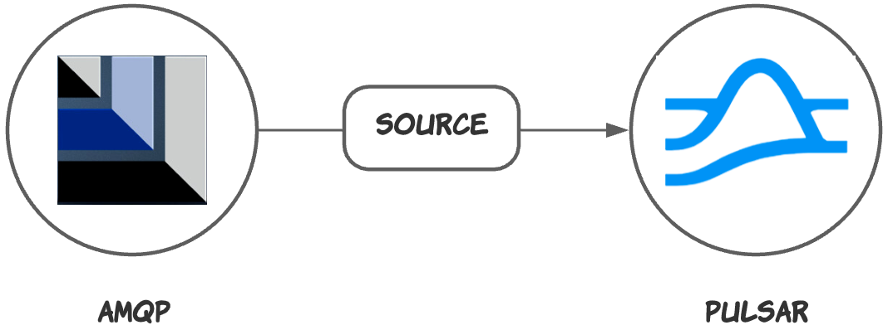
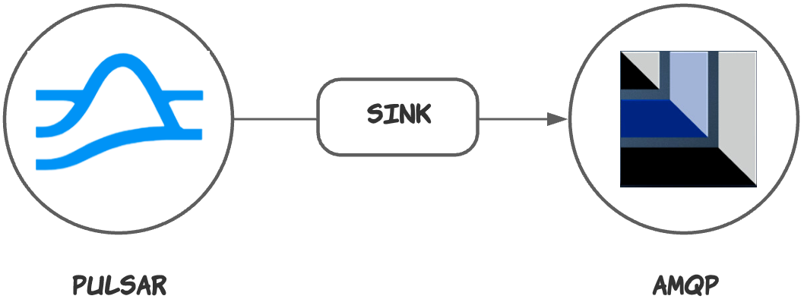

# AMQP1_0 connector

The AMQP1_0 connector is a [Pulsar IO connector](http://pulsar.apache.org/docs/en/next/io-overview/) for exchanging data between [AMQP 1.0](https://www.amqp.org/) and [Pulsar](https://pulsar.apache.org/docs/en/next/standalone/). It consists of two types of connectors: 

- AMQP1_0 **source** connector 
  
  This connector feeds data from AMQP and writes data to Pulsar topics. 

  

- AMQP1_0 **sink** connector 
  
  This connector pulls data from Pulsar topics and persists data to AMQP.

  
            
## Doc

| AMQP1_0 connector version |Pulsar version| Doc |
| :---------- |  :------------- |:------------- |
2.7.0 | 2.7.0 |  - [AMQP1_0 source connector](TBD)<br><br>  - [AMQP1_0 sink connector](TBD)

## Project layout

Below are the sub folders and files of this project and their corresponding descriptions.

```bash
├── conf // examples of configuration files of this connector
├── docs // user guides of this connector
├── script // scripts of this connector
├── io-amqp1_0-impl
│   ├── src // source code of this connector
├── tests // integration test
├── src
│   ├── checkstyle // checkstyle configuration files of this connector
│   ├── license // license header for this project. `mvn license:format` can be used for formatting the project with the stored license header in this directory
│   │   └── ALv2
│   ├── spotbugs // spotbugs configuration files of this connector
```
